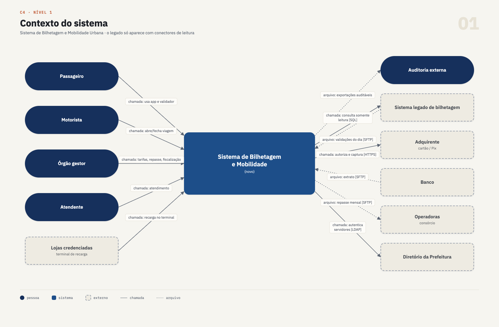
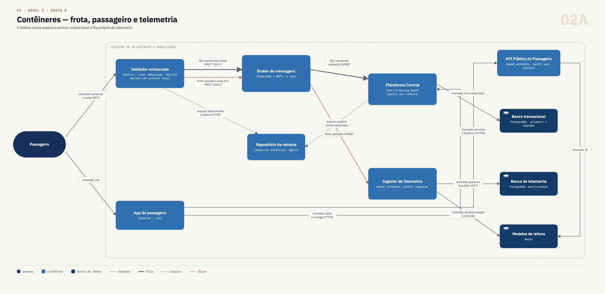
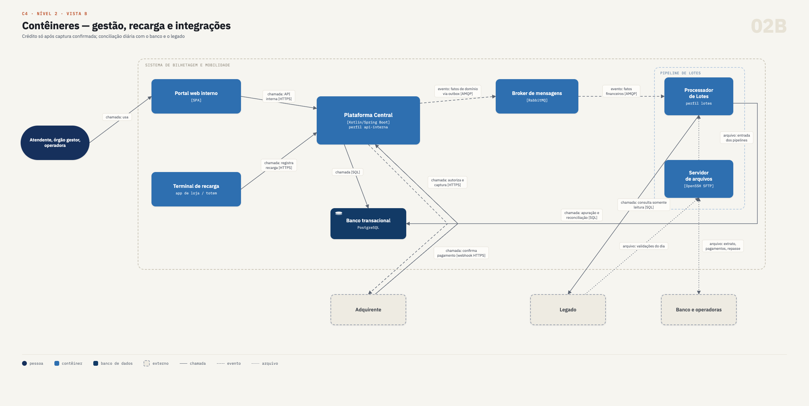
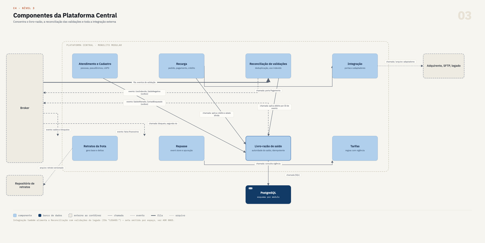
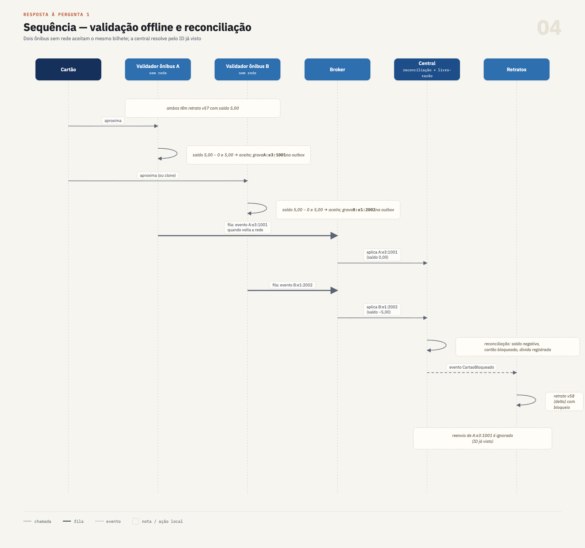

# Entrega 2 — Documento de arquitetura

**Grupo 08** · Caso **Ônibus: bilhetagem e mobilidade urbana** · Envelope **C**
Padrões e Arquitetura de Software · PUC-Campinas · 2026-2

> Continuação da [matriz de estilos (Entrega 1)](../1-matriz/matriz.md). Os ADRs estão em [`adr/`](adr/), no formato do capítulo 4 do livro (seis partes, numeração `NNNN`, status controlado).

> **Versão visual:** os diagramas foram exportados para PNG para melhorar legibilidade e apresentação. Os arquivos estão em [`diagramas_png/`](diagramas_png/).

## Sumário

1. [Contexto, envelope e premissas](#1-contexto-envelope-e-premissas)
2. [Visão geral da solução](#2-visão-geral-da-solução)
3. [C4 nível 1 — Contexto](#3-c4-nível-1--contexto)
4. [C4 nível 2 — Contêineres](#4-c4-nível-2--contêineres)
5. [C4 nível 3 — Componentes da Plataforma Central](#5-c4-nível-3--componentes-da-plataforma-central)
6. [Mapa de restrições e decisões](#6-mapa-de-restrições-e-decisões)
7. [Respostas às cinco perguntas obrigatórias](#7-respostas-às-cinco-perguntas-obrigatórias)
8. [Riscos e ligação com a Entrega 3](#8-riscos-e-ligação-com-a-entrega-3)
9. [Índice de ADRs](#9-índice-de-adrs)

---

## 1. Contexto, envelope e premissas

### 1.1 O caso

O órgão gestor do transporte vai substituir um sistema de bilhetagem monolítico, fechado e dependente de rede. O novo sistema cobre validação embarcada, cartões e recarga, telemetria, informação ao passageiro, repasse entre operadoras e Prefeitura, integração externa e atendimento. As premissas de dimensionamento são: 1.200 ônibus, 900 mil validações por dia útil (pico de 120/s), 2,5 milhões de cartões ativos, 150 mil recargas por dia, posição GPS a cada 15 s (80/s em média e até 400/s em pico) e ônibus que podem ficar até 4 horas sem rede.

### 1.2 O envelope C

| Restrição do envelope | Consequência para a arquitetura |
|---|---|
| Quem opera é a **Prefeitura**, com **orçamento anual fixo** | Custo previsível; software livre sem cobrança por uso |
| **10 desenvolvedores** | Uma base de código principal, com fronteiras internas claras |
| **2 profissionais de infraestrutura** | Poucos tipos de componente; nada que exija equipe de plataforma |
| **Servidores próprios, dados on-premise**, sem nuvem | Sem elasticidade: capacidade dimensionada pelo pico |
| **O legado não pode ser desligado** | Operação paralela e substituição gradual |
| O legado só oferece **banco somente leitura** e **arquivos diários** | Dados do legado chegam em D+1 e nada é escrito nele |

### 1.3 Premissas adotadas pelo grupo

- **P1.** O cartão identifica o passageiro (chip sem contato com autenticação). O **saldo não fica no cartão**: a autoridade é o livro-razão da central, e o validador trabalha com um retrato local ([ADR 0005](adr/0005-validar-passagem-offline-e-reconciliar-por-eventos.md)).
- **P2.** Cada ônibus tem um computador de bordo que reúne validador e GPS, com Linux embarcado, armazenamento persistente e modem 4G. O horário do GPS serve de referência de relógio.
- **P3.** A migração é feita por garagem. Os ônibus ainda não migrados continuam no validador do legado.
- **P4.** A Prefeitura tem um cluster de virtualização no data center municipal e um segundo prédio que pode receber cópias de backup.
- **P5.** O backend é escrito em Kotlin sobre JVM (Spring Boot). Java serviria sem mudar a arquitetura.

---

## 2. Visão geral da solução

A arquitetura é híbrida, como a matriz da Entrega 1 indicava. Seguindo o § 4.6 do livro, o [ADR 0001](adr/0001-adotar-monolito-modular-com-borda-embarcada-autonoma.md) é o **ADR de composição**: diz quais estilos convivem, onde cada um começa e termina, e de quais ADRs de fronteira depende.

| Estilo | Onde é usado | Onde não é usado | ADR |
|---|---|---|---|
| Monolito modular | Núcleo transacional no data center | Dentro do ônibus | 0001 |
| Borda autônoma | Validador, que decide com retrato local | Nenhum embarque depende da central | 0005 |
| Hexagonal | Integração com legado, adquirente, banco e operadoras | Módulos sem dependência externa relevante | 0003 |
| Orientado a eventos | Ônibus → central (outbox e fila); reações entre módulos | Caminho da decisão de embarque | 0005, 0002 |
| CQRS | Informação ao passageiro e fiscalização (leitura) | Livro-razão de saldo | 0008, 0005 |
| Event Sourcing | Fatos financeiros do repasse | Cadastro de pessoas, telemetria | 0006 |
| Pipes and Filters | Importação do legado, conciliação bancária, apuração | Fluxos online | 0003, 0006 |

A ideia central: **o ônibus nunca espera a central, e a central nunca confia cegamente no ônibus.** O validador decide com o retrato que tem, sem nenhuma chamada de rede no caminho da decisão. Tudo o que ele aceitou vira evento com ID único, que sobe quando há rede e é aplicado de forma idempotente e reconciliado pela central.

### 2.1 Legenda dos conectores

O enunciado pede os conectores rotulados pelo tipo. O § 3.6 do livro pede que, no C4, a seta traga a ação e a tecnologia. Por isso, cada rótulo segue o formato **`tipo: ação [tecnologia]`**.

| Tipo | Significado | Exemplo |
|---|---|---|
| **chamada** | Requisição e resposta síncrona | App consulta saldo |
| **evento** | Publicação de um fato; o publicador não conhece os consumidores | `RecargaConfirmada` |
| **fila** | Mensagem persistente com confirmação e reentrega | Eventos de validação do ônibus |
| **arquivo** | Troca em lote por arquivo | Arquivo diário do legado; retrato da frota |
| **fluxo** | Sequência contínua de mensagens pequenas | Posições GPS a cada 15 s |

Todas as figuras respeitam o limite de 12 elementos do § 3.6. Por isso, o nível 2 está dividido em duas vistas do mesmo sistema.

---

## 3. C4 nível 1 — Contexto

**Diagrama 1 — Contexto (12 elementos).** O legado só aparece com conectores de leitura, porque é o que o envelope permite.

---

## 4. C4 nível 2 — Contêineres

### 4.1 Vista A — frota, passageiro e telemetria

**Diagrama 2A — Contêineres: frota, passageiro e telemetria (11 elementos).**

### 4.2 Vista B — gestão, recarga e integrações

**Diagrama 2B — Contêineres: gestão, recarga e integrações (11 elementos).**

### 4.3 Responsabilidade de cada contêiner

| Contêiner | Responsabilidade | ADR |
|---|---|---|
| **Validador embarcado** | Decide sem rede com o retrato local mais os débitos feitos desde o retrato; grava cada validação aceita como evento `ônibus:época:sequencial` na outbox; envia posições | 0005 |
| **Broker** | Recebe tudo o que vem da frota; absorve picos e reconexões; distribui eventos internos. Filas de validação e telemetria separadas | 0008, 0004 |
| **Plataforma Central** | Monolito modular: livro-razão, recarga, reconciliação, tarifas, retratos, atendimento, integração | 0001 |
| **API Pública** | Somente leitura para o passageiro; escala separada no rush | 0008 |
| **Ingestor de Telemetria** | Consome posições em lote; grava no banco de telemetria; atualiza previsões | 0008 |
| **Processador de Lotes** | Pipelines de importação do legado, conciliação bancária e apuração do repasse | 0003, 0006 |
| **Repositório de retratos** | Retrato versionado (base + deltas) com saldos, bloqueios, gratuidades e bilhetes avulsos (QR) | 0005 |
| **Banco transacional** | Um esquema por módulo; livro-razão; IDs de eventos já aplicados; outbox; auditoria; event store do repasse | 0002 |
| **Banco de telemetria / Redis** | Posições brutas com retenção de 90 dias / modelos de leitura descartáveis | 0002, 0008 |
| **Servidor SFTP** | Troca de arquivos com legado, banco e operadoras | 0003 |

Há **um único artefato de servidor**, executado em quatro perfis. Os 10 desenvolvedores mantêm um repositório; os 2 de infraestrutura operam uma imagem. Os perfis existem porque telemetria, leitura pública e lotes têm cargas diferentes e **não podem derrubar o núcleo** ([ADR 0004](adr/0004-implantar-on-premise-em-vms-com-containers.md)). A implantação é feita em cerca de 13 VMs com Docker Compose, atrás de HAProxy com IP virtual.

---

## 5. C4 nível 3 — Componentes da Plataforma Central

O contêiner detalhado é a **Plataforma Central**, porque concentra o dinheiro (livro-razão, recarga, repasse), a reconciliação das validações e toda a integração. O validador é o contêiner de **maior risco técnico**; seu comportamento é a decisão do [ADR 0005](adr/0005-validar-passagem-offline-e-reconciliar-por-eventos.md), provada no spike da Entrega 3.

**Diagrama 3 — Componentes da Plataforma Central (12 elementos).** O módulo Integração também alimenta a Reconciliação com as validações do legado (`LEGADO:`). Essa seta foi omitida para respeitar o limite de elementos e está descrita no [ADR 0003](adr/0003-substituir-legado-gradualmente-com-camada-anticorrupcao.md).

### 5.1 Regras de fronteira entre módulos

1. Cada módulo é dono de um esquema do PostgreSQL e de um usuário de banco com permissão só nele ([ADR 0002](adr/0002-usar-postgresql-com-esquema-por-modulo.md)).
2. Um módulo fala com outro por **chamada** à interface pública (quando precisa de resposta na mesma transação) ou por **evento** via outbox (quando só avisa).
3. Formatos externos só existem nos adaptadores do módulo Integração.
4. As regras 1 a 3 são verificadas por testes de arquitetura (ArchUnit) no pipeline.

### 5.2 Componentes

| Componente | Faz | Não faz |
|---|---|---|
| **Livro-razão de saldo** | Autoridade do saldo: recargas somam, validações subtraem; aplica cada evento uma única vez pelo ID; marca saldo negativo | Não decide embarque |
| **Recarga** | Pedido, pagamento; gera crédito só após captura confirmada; abate dívida pendente | Não fala com o ônibus |
| **Reconciliação de validações** | Recebe eventos da frota e do legado; deduplica por ID; resolve bilhete usado em dois ônibus (vale o primeiro por hora) | Não recalcula tarifa cobrada |
| **Retratos da frota** | Monta retrato versionado (base + deltas) com saldos, bloqueios, gratuidades e bilhetes avulsos (QR) | Não conversa com o ônibus (o ônibus baixa) |
| **Tarifas** | Regras de tarifa e repartição com vigência | Não calcula repasse |
| **Repasse** | Event store financeiro e apuração versionada | Não guarda dado pessoal |
| **Atendimento e Cadastro** | Pessoas, vínculo pessoa-cartão-pseudônimo, gratuidades, pedidos LGPD, contestação | Não altera fatos financeiros |
| **Integração** | Adaptadores para legado, adquirente, banco e operadoras | Não contém regra de negócio |

---

## 6. Mapa de restrições e decisões

| # | Restrição ou requisito | Origem | Decisão | ADR | Diagrama |
|---|---|---|---|---|---|
| E1 | Orçamento anual fixo | Envelope | Só software livre sem cobrança por uso; capacidade para pico + 50% | 0004 | 2A, 2B |
| E2 | 10 desenvolvedores | Envelope | Monolito modular num repositório; fronteiras testadas | 0001 | 3 |
| E3 | 2 profissionais de infraestrutura | Envelope | Um artefato em quatro perfis; Docker Compose em VMs, sem Kubernetes | 0004 | 2A |
| E4 | Servidores próprios, sem nuvem | Envelope | Tudo no data center municipal; picos absorvidos por fila e cache | 0004, 0008 | 2A |
| E5 | Dados on-premise | Envelope | PostgreSQL local, backup no segundo prédio, pseudonimização | 0002, 0007 | 2A |
| E6 | Legado não pode ser desligado | Envelope | Migração por garagem; legado segue autoridade para os ônibus não migrados | 0003 | 1, 2B |
| E7 | Legado só com banco de leitura e arquivo diário | Envelope | Camada anticorrupção; pipeline D+1; IDs `LEGADO:` na mesma deduplicação | 0003, 0005 | 2B |
| R1 | Resposta em até 300 ms sem conexão | Validação | Decisão local com retrato versionado | 0005 | 2A |
| R2 | Não aceitar a mesma passagem duas vezes | Validação | ID `ônibus:época:sequencial`; livro-razão idempotente; reconciliação (vale o primeiro uso) | 0005 | 3 |
| R3 | Até 4 h sem rede | Rede | Outbox local (store-and-forward) até confirmação | 0005 | 2A |
| R4 | Saldo consistente entre app e ônibus | Cartões e recarga | Livro-razão como autoridade; saldo novo chega no retrato seguinte | 0005 | 2A, 3 |
| R5 | Fraude de recarga zero | Cartões e recarga | Crédito só após captura; idempotência por pedido; conciliação diária | 0003 | 2B, 3 |
| R6 | Conciliação com o banco | Cartões e recarga | Pipeline diário extrato × recargas | 0003 | 2B |
| R7 | 80/s em média, 400/s em pico, sem perda | Telemetria | MQTT QoS 1; fila própria limitada; ingestor e banco isolados | 0008 | 2A |
| R8 | Pico no rush, custo baixo fora dele | Informação | API pública separada lendo Redis; cache HTTP | 0008 | 2A |
| R9 | Recalcular mês com regra vigente na data | Repasse | Regras com vigência; event store; apuração versionada | 0006 | 3 |
| R10 | Contestação em até 30 dias | Repasse | Apuração provisória e definitiva; ajustes como novos eventos | 0006 | 3 |
| R11 | Formatos impostos; janelas de indisponibilidade | Integração | Adaptadores hexagonais; reenvio via fila; nenhum terceiro no embarque | 0003 | 2B |
| R12 | Trilha de auditoria | Atendimento | Auditoria append-only na mesma transação | 0002 | 3 |
| R13 | Histórico é dado pessoal (LGPD) | Guarda de dados | Pseudônimo; vínculo cifrado com chave por titular; destruição da chave | 0002, 0007 | 3 |

---

## 7. Respostas às cinco perguntas obrigatórias

### 7.1 Como o validador aceita a passagem sem rede, e como o sistema descobre depois que a mesma passagem foi usada em dois ônibus?

**Aceitar sem rede.** O validador tem um **retrato local versionado** enviado pela central, com saldos, bloqueios, gratuidades e bilhetes avulsos (QR). Ele também guarda os **débitos que fez desde o último retrato**. Para decidir, calcula o saldo disponível (saldo do retrato menos os débitos locais), confere bloqueio e gratuidade e responde. Nenhuma etapa usa rede. O spike prova que não há rede no caminho da decisão. O tempo no hardware embarcado ainda precisa ser medido no piloto.

**Registrar.** Cada validação aceita vira um evento com ID `ônibus:época:sequencial`, gerado no próprio aparelho sem coordenação com ninguém. A **época** é definida pela central na instalação do validador, feita na garagem com rede, e muda a cada troca ou reinstalação. Sem ela, o sequencial voltaria a 1 e viagens legítimas seriam descartadas como já vistas. O evento fica na **outbox** local até a central confirmar o recebimento (store-and-forward).

**Descobrir o uso duplicado.** A central aplica cada evento no **livro-razão** uma única vez pelo ID, então reenvio e ordem de chegada não mudam nada. Depois de cada sincronização, a **reconciliação** procura o mesmo bilhete em ônibus diferentes: vale o primeiro uso por horário, e os demais são marcados como **indevidos**. O horário vem do relógio do validador, sincronizado pelo GPS, que o ônibus recebe a cada 15 s mesmo sem 4G. Se um cartão ficar com saldo negativo, ele entra na lista de bloqueio, que chega aos ônibus no **retrato seguinte**, e a dívida é abatida na próxima recarga.

O grupo assume que existe uma **janela de uso duplo entre sincronizações**. A perda é limitada à janela sem rede e ao valor da tarifa.

**Diagrama 4 — Validação offline, reconciliação e bloqueio.**

**Sustentação:** [ADR 0005](adr/0005-validar-passagem-offline-e-reconciliar-por-eventos.md), [ADR 0002](adr/0002-usar-postgresql-com-esquema-por-modulo.md) (IDs já vistos), [ADR 0003](adr/0003-substituir-legado-gradualmente-com-camada-anticorrupcao.md) (eventos `LEGADO:`); Diagramas 2A, 3 e 4.

### 7.2 Como o saldo do cartão fica consistente entre recarga no aplicativo e uso no ônibus, com atraso de sincronização?

Existe **uma só autoridade**: o livro-razão da central (um registro de lançamentos idempotente; não é Event Sourcing, que fica restrito ao repasse, § 15.6). Recargas somam e validações subtraem, e cada lançamento é aplicado uma única vez pelo seu ID. Por isso, **o resultado final não depende da ordem** em que recarga e validações chegam. Isso é o que garante a consistência, mesmo com atraso.

A recarga pelo aplicativo só vira crédito depois da **captura confirmada** pela adquirente, com chave de idempotência por pedido. O crédito entra no livro-razão na hora, e o saldo novo chega aos ônibus no **próximo retrato** (delta). Enquanto isso, o ônibus usa o retrato anterior menos os débitos locais, ou seja, é **conservador**: pode não enxergar a recarga ainda, mas não inventa saldo. Se houver dívida (saldo negativo de uma janela offline), ela é abatida dessa recarga. O aplicativo mostra o saldo do livro-razão e avisa que a recarga "chega aos ônibus em alguns minutos".

**Sustentação:** [ADR 0005](adr/0005-validar-passagem-offline-e-reconciliar-por-eventos.md), [ADR 0003](adr/0003-substituir-legado-gradualmente-com-camada-anticorrupcao.md) (captura e conciliação bancária); Diagramas 2A, 2B e 3.

### 7.3 Como a telemetria escala no pico sem derrubar o restante do sistema?

Três barreiras separam a telemetria do núcleo:

1. **Buffer no ônibus.** As posições saem por MQTT QoS 1. Sem rede, ficam guardadas localmente e sobem na reconexão, marcadas como atrasadas.
2. **Fila própria e limitada no broker.** O pico de 400/s e as rajadas de reconexão ficam na fila `telemetria`. Ela é separada da fila de eventos de validação e tem limite de tamanho, então acúmulo de telemetria nunca atrasa o fluxo financeiro.
3. **Processamento e banco isolados.** O perfil `ingestor` consome em lotes, grava por `COPY` num PostgreSQL próprio e atualiza posição e previsão no Redis. Se ele cair, a fila acumula, e validação, recarga e repasse continuam funcionando.

Sem nuvem, escala-se por dimensionamento: 400 mensagens por segundo é carga pequena para RabbitMQ e PostgreSQL em lote. A leitura usa CQRS: a API pública lê só o Redis, com cache HTTP de 10 a 15 s.

**Sustentação:** [ADR 0008](adr/0008-isolar-telemetria-em-fluxo-mqtt-com-ingestor-proprio.md), [ADR 0002](adr/0002-usar-postgresql-com-esquema-por-modulo.md), [ADR 0004](adr/0004-implantar-on-premise-em-vms-com-containers.md); Diagrama 2A.

### 7.4 Como o repasse mensal é recalculado se uma regra de tarifa mudou no meio do mês?

O **valor cobrado do passageiro** é um fato registrado no evento de validação e não muda. O que se recalcula é a **repartição** entre operadoras e Prefeitura.

- Cada regra é guardada com vigência (`vigente_de`, `vigente_ate`) e data de registro. Se ela mudou no dia 15, as viagens de 1 a 14 usam a versão antiga e as demais, a nova.
- Os fatos financeiros (validações do sistema novo e `LEGADO:`, recargas, estornos, ajustes) ficam num **event store** append-only, só com pseudônimo.
- A apuração é um pipeline que relê os fatos do mês e aplica a regra vigente no instante de cada viagem. Cada execução gera uma **versão** nova; nada é sobrescrito, e o relatório de diferenças mostra o impacto por operadora.
- Uma mudança retroativa vira nova versão da regra com vigência no passado, seguida de nova apuração.
- A apuração provisória é seguida da janela de 30 dias de contestação e, depois, da apuração definitiva.

**Sustentação:** [ADR 0006](adr/0006-registrar-fatos-financeiros-como-eventos-no-repasse.md), [ADR 0005](adr/0005-validar-passagem-offline-e-reconciliar-por-eventos.md) (origem dos eventos); Diagramas 2B e 3.

### 7.5 Como o histórico de viagens de uma pessoa é apagado quando ela pede, sem quebrar a conciliação financeira?

A conciliação **nunca precisou saber quem é a pessoa**. Os eventos identificam o cartão só por um **pseudônimo** aleatório. Os dados pessoais e o vínculo pessoa-cartão-pseudônimo ficam no módulo Atendimento, **cifrados com uma chave por titular**.

No pedido de eliminação, o sistema confere pendências (contestação aberta, dívida ou saldo a devolver, obrigação legal de guarda). Depois apaga os dados pessoais e o vínculo, **destrói a chave** e remove os modelos de leitura daquele pseudônimo, como o histórico no app. Os fatos financeiros ficam intactos e **anônimos**, então repasse e conciliação continuam fechando. Backups antigos do vínculo ficam ilegíveis sem a chave.

Limitações assumidas: dados pessoais no legado não podem ser apagados por nós (acesso somente leitura), e a retenção por obrigação legal (LGPD, art. 16, I) precisa ser validada com o jurídico da Prefeitura.

**Sustentação:** [ADR 0007](adr/0007-pseudonimizar-viagens-e-apagar-por-destruicao-de-chave.md), [ADR 0002](adr/0002-usar-postgresql-com-esquema-por-modulo.md), [ADR 0006](adr/0006-registrar-fatos-financeiros-como-eventos-no-repasse.md); Diagrama 3.

---

## 8. Riscos e ligação com a Entrega 3

| Risco | Mitigação | ADR |
|---|---|---|
| Uso duplo na janela entre sincronizações | Perda limitada à janela e à tarifa; bloqueio no retrato seguinte; dívida abatida na recarga | 0005 |
| Relógio do validador desalinhado decide errado qual uso vale | Horário do GPS como referência, recebido mesmo sem 4G | 0005 |
| Validador trocado ou reinstalado reinicia o sequencial | Época nova definida pela central na instalação | 0005 |
| Tempo de decisão no hardware embarcado acima de 300 ms | O spike só prova ausência de rede no caminho; medir no piloto | 0005 |
| Retrato de 2,5 milhões de cartões pesado demais para 4G | Envio incremental (delta) entre versões | 0005 |
| Tabela de IDs já vistos crescer sem limite | Particionamento por mês | 0002 |
| Arquivo diário do legado atrasar ou vir malformado | Quarentena e reprocessamento; apuração provisória aceita complemento | 0003 |
| Queda do data center | Validadores continuam operando; RPO 5 min, RTO 4 h | 0004 |
| Acoplamento gradual entre módulos | Testes de arquitetura quebrando o build | 0001 |

**Spike da Entrega 3.** O spike (`3-spike/exemplo.py`, Python 3.12, só biblioteca padrão) prova o [ADR 0005](adr/0005-validar-passagem-offline-e-reconciliar-por-eventos.md). Ele simula dois ônibus 4 horas sem rede enquanto o passageiro recarrega pelo aplicativo, com confirmação perdida no 4G (lote reenviado), lote fora de ordem e troca de validador. A saída mostra que nenhum evento se perde nem é contado duas vezes, que o bilhete duplicado e o gasto além do saldo são detectados e que o saldo fecha. A contraprova sem idempotência leva o cartão a −R$ 15,00 em vez de −R$ 5,00. O mecanismo é o da Listagem 11.1 do livro (§ 11.4).

---

## 9. Índice de ADRs

| ADR | Decisão | Cobre |
|---|---|---|
| [0001](adr/0001-adotar-monolito-modular-com-borda-embarcada-autonoma.md) | Adotar monolito modular com borda embarcada autônoma (composição) | **Estrutura geral** |
| [0002](adr/0002-usar-postgresql-com-esquema-por-modulo.md) | Usar PostgreSQL com esquema por módulo, banco de telemetria separado e outbox | **Dados** |
| [0003](adr/0003-substituir-legado-gradualmente-com-camada-anticorrupcao.md) | Substituir o legado gradualmente com camada anticorrupção | **Integração com legado e terceiros** |
| [0004](adr/0004-implantar-on-premise-em-vms-com-containers.md) | Implantar on-premise em VMs com containers | **Operação e implantação** |
| [0005](adr/0005-validar-passagem-offline-e-reconciliar-por-eventos.md) | Validar offline com retrato local e reconciliar na central | **Decisão mais arriscada**; perguntas 1 e 2 |
| [0006](adr/0006-registrar-fatos-financeiros-como-eventos-no-repasse.md) | Registrar fatos financeiros como eventos e versionar regras | Pergunta 4 |
| [0007](adr/0007-pseudonimizar-viagens-e-apagar-por-destruicao-de-chave.md) | Pseudonimizar viagens e apagar por destruição de chave | Pergunta 5 |
| [0008](adr/0008-isolar-telemetria-em-fluxo-mqtt-com-ingestor-proprio.md) | Isolar telemetria em fluxo MQTT com ingestor próprio | Pergunta 3 |
